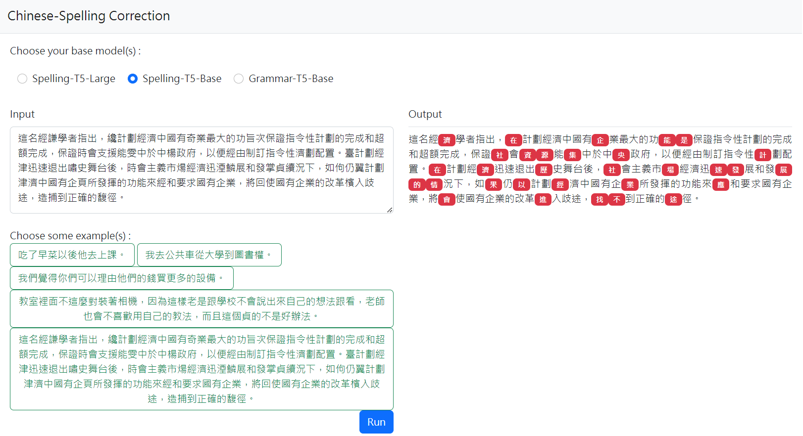

# Chinese Grammarly - Chinese Grammatical Error Correction

<p align='center'>
🤗<a href='https://huggingface.co/CodeTed/CGEDit'>Huggingface Repo</a> •📃<a href=''>[Paper Coming Soon]</a> •👨️<a href='https://github.com/TedYeh'>Cheng-Hung Yeh</a>
</p>

 

## Overview
A Web Interface for Chinese Grammatical Error Correction.

**Spelling-T5-Base** instruction-tuned on over 1M sentences in traditional mandarin.

**Grammar-T5-Base** instruction-tuned on 5 tasks and over 150k sentences in traditional mandarin.

## Usage

install necessary packages.
```bash
pip install -r requirements.txt
```

Setup flask web interface.
```bash
cd csc_t5
python demo.py
```

Finally, if you want to retrain the t5-cged model, following this command:
```bash
cd csc_t5
python training_zh_prompt_model_csc.py --do_train --do_predict
```